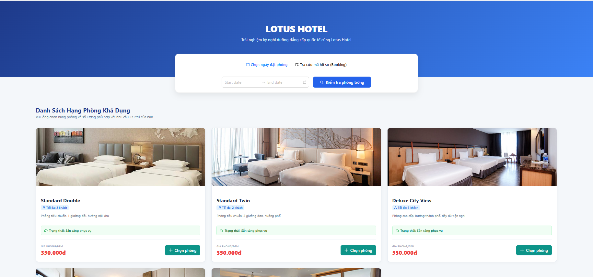
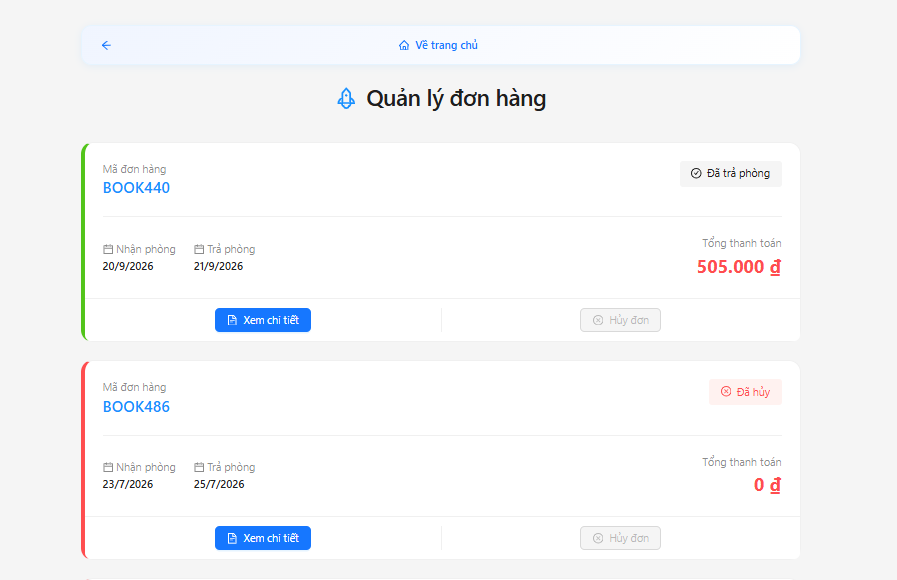
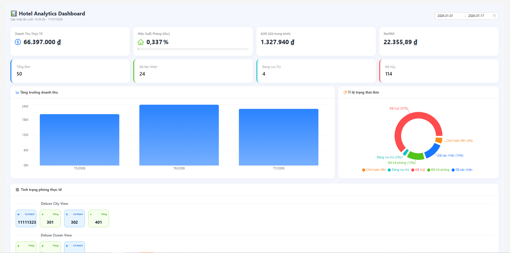
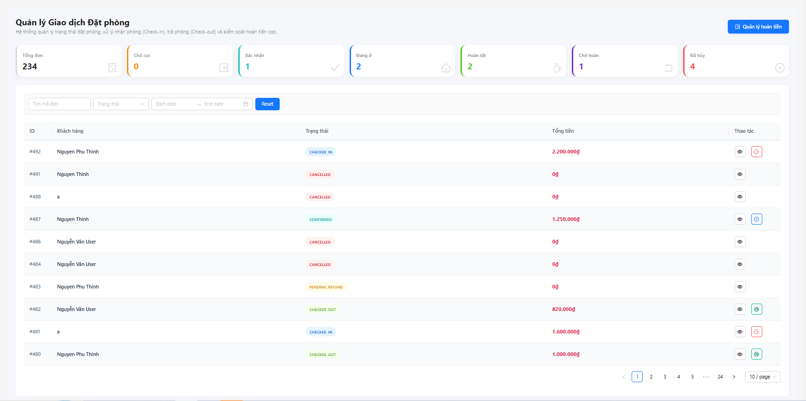
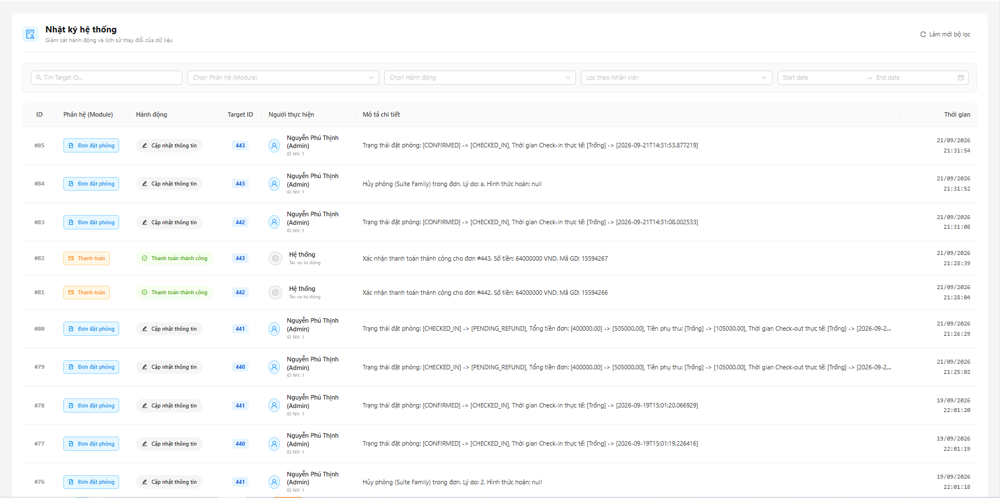
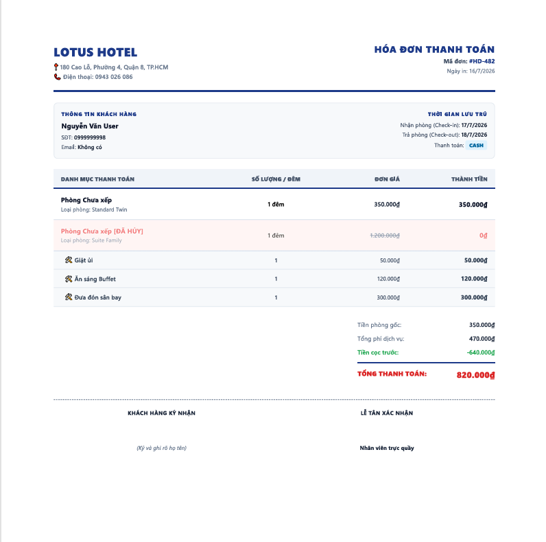

# Hotel Booking Management System


A backend-focused hotel booking management system built with Spring Boot and React.

The project demonstrates the implementation of a secure RESTful backend using Spring Boot, Spring Security, JWT, MySQL, Docker Compose, and modern Java development practices.

---

# Project Overview

The system provides two primary interfaces:

- Customer Portal
  - Browse available rooms
  - Create bookings
  - Online payment with VNPay Sandbox
  - Booking history
  - PDF invoice

- Administration Portal
  - Dashboard
  - Booking management
  - Room management
  - Room type management
  - Customer management
  - Employee management
  - Service management
  - Payment management
  - Audit log

The backend exposes REST APIs secured with Spring Security and JWT, while the frontend communicates through Axios.

---

# Key Features

### Authentication & Authorization

- JWT Authentication
- Spring Security
- BCrypt password encryption
- Role-based authorization
- Protected REST APIs

### Booking Management

- Search available rooms
- Create bookings
- Booking confirmation
- Booking cancellation
- Room assignment
- Check-in / Check-out
- Booking history

### Payment

- Cash payment
- VNPay Sandbox integration
- Payment status management
- Refund processing

### Room Management

- Room CRUD
- Room Type CRUD
- Room availability checking
- Room status management

### Customer & Employee Management

- Customer CRUD
- Employee CRUD
- User account management
- Role management

### Hotel Services

- Service CRUD
- Add services to bookings
- Service usage tracking

### Dashboard

- Revenue statistics
- Booking statistics
- Room statistics
- Payment statistics

### Additional Features

- PDF invoice generation
- Audit logging
- Swagger API documentation
- Global exception handling
- Request validation
- Docker deployment

---

# Technology Stack

## Backend

- Java 21
- Spring Boot 3.3.5
- Spring Security
- Spring Data JPA
- Spring Validation
- Spring Mail
- Spring WebSocket
- JWT
- MapStruct
- Lombok
- Swagger (OpenAPI)

## Frontend

- React
- Vite
- Ant Design
- Axios

## Database

- MySQL 8

## Deployment

- Docker
- Docker Compose
- Nginx

---

# Project Structure

```text
HotelBooking/
│
├── BE/
│   └── Hotel_Booking/
│
├── FE/
│   └── hotel-booking-ui/
│
├── database/
│
├── docs/
│   └── images/
│
├── storage/
│
├── docker-compose.yml
├── .env.example
└── README.md
```

The repository is organized into independent backend and frontend applications, allowing each service to be developed and deployed separately.

Docker Compose is used to orchestrate the complete application stack, including MySQL, Spring Boot, and the React frontend.

# Backend Architecture

The backend follows a **feature-based package structure**, where each business domain is organized into its own package.

Instead of separating code by technical layers only, related components such as controllers, services, repositories, DTOs, and entities are grouped together by feature. This approach improves maintainability, reduces coupling between modules, and makes the project easier to extend as new business requirements are introduced.

Current business modules include:

- Audit
- Booking
- Booking Room
- Booking Service Detail
- Customer
- Dashboard
- Employee
- Payment
- Role
- Room
- Room Type
- Security
- Service
- User

Shared components such as configuration, exception handling, and reusable utilities are placed inside the `common` package.

---

# Package Organization

```text
src/main/java/com/example/hotel_booking
│
├── audit/
├── booking/
├── bookingroom/
├── bookingservicedetail/
├── common/
├── config/
├── customer/
├── dashboard/
├── employee/
├── payment/
├── role/
├── room/
├── roomtype/
├── security/
├── service/
├── user/
│
└── HotelBookingApplication.java
```

Each feature encapsulates its own business logic, making the project easier to navigate and reducing dependencies across unrelated modules.

---

# Security

Authentication and authorization are implemented using Spring Security and JSON Web Tokens (JWT).

Security features include:

- JWT-based authentication
- Role-based authorization
- Password encryption with BCrypt
- Protected REST endpoints
- Stateless authentication

Only authenticated users can access protected resources, while authorization rules are enforced based on user roles.

---

# Exception Handling

The application implements centralized exception handling using `@RestControllerAdvice`.

Business exceptions are represented by a custom `AppException`, while predefined `ErrorCode` values provide consistent application error codes, HTTP status codes, and user-friendly messages.

Validation errors generated by `@Valid` are handled separately to provide clear feedback for invalid client requests.

This approach ensures that API responses remain consistent across the entire application.

---

# Standard API Response

REST APIs return a unified response structure.

Successful responses:

```json
{
    "code": 1000,
    "message": "Success",
    "result": {
        
    }
}
```

Example error response:

```json
{
    "code": 3001,
    "message": "Không tìm thấy đơn đặt phòng"
}
```

The response format simplifies frontend integration and provides predictable error handling for client applications.

---

# Data Validation

Incoming requests are validated using Spring Validation.

Validation rules are applied before business logic is executed, helping prevent invalid data from reaching the service layer.

Common validations include:

- Required fields
- Date validation
- Numeric constraints
- Business rule validation

Validation errors are automatically converted into standardized API responses through the global exception handler.

---

# API Documentation

The backend provides interactive API documentation using Swagger (OpenAPI).

After starting the backend service, the documentation is available at:

```text
http://localhost:8080/swagger-ui/index.html
```

Swagger can be used to explore available endpoints, inspect request and response models, and test APIs directly from the browser.

# Prerequisites

Before running the project, make sure the following tools are installed:

| Software | Version |
|----------|---------|
| Java | 21 |
| Node.js | 20+ |
| MySQL | 8.x |
| Docker Desktop | Latest |
| Git | Latest |

---

# Getting Started

Clone the repository:

```bash
git clone https://github.com/PhuThinh64/hotel-booking-system.git

cd HotelBooking
```

---

# Environment Variables

Copy the example configuration file:

```bash
Windows

copy .env.example .env

Linux/macOS

cp .env.example .env
```

Or manually copy `.env.example` to `.env`.

The default application and database configuration is already provided.

If you want to test the **Forgot Password** feature, configure the following variables in `.env`:

| Variable | Description |
|----------|-------------|
| `MAIL_USERNAME` | Gmail address |
| `MAIL_PASSWORD` | Gmail App Password |

**Note**

`MAIL_PASSWORD` must be a Gmail App Password, not your Gmail account password.

If these values are left empty, the application will still run normally, but the Forgot Password feature will be unavailable.

# Running with Docker

Build and start all services:

```bash
docker compose up --build -d
```

The first startup may take several minutes because MySQL needs to initialize the database and import the sample data.

Check the container status:

```bash
docker compose ps
```

Stop all services:

```bash
docker compose down
```

Remove containers and database volume:

```bash
docker compose down -v
```

The Docker Compose configuration starts:

- MySQL 8
- Spring Boot Backend
- React Frontend (served by Nginx)

---

# Running Without Docker

## Backend

```bash
cd BE/Hotel_Booking

./gradlew bootRun
```

or on Windows:

```bash
gradlew.bat bootRun
```

---

## Frontend

```bash
cd FE/hotel-booking-ui

npm install

npm run dev
```

---

# Application URLs

After the application starts successfully:

| Service | URL |
|---------|-----|
| Frontend | http://localhost:5173 |
| Backend REST API | http://localhost:8080 |
| Swagger UI | http://localhost:8080/swagger-ui/index.html |

---

# File Storage

Uploaded files are persisted using a Docker volume mounted to:

```text
storage/uploads
```

Files remain available even after restarting the containers.

---

# Database Initialization

During the first startup, MySQL automatically executes the SQL scripts located in the `database` directory to create the database schema and import the sample data.

Database data is stored in the Docker volume:

```text
hotel-data
```

If the volume is removed using:

```bash
docker compose down -v
```

the database will be recreated and initialized again during the next startup.

---

# Screenshots

## Customer Interface






## Administration Dashboard









---

# Design Decisions

Several implementation choices were made to keep the project maintainable and easy to extend.

- Feature-based package organization instead of a large layer-based structure.
- Centralized exception handling using `AppException`, `ErrorCode`, and `GlobalExceptionHandler`.
- Unified API response format for all REST endpoints.
- JWT-based authentication with stateless authorization.
- Environment-based configuration using `.env`.
- Docker Compose for consistent local development.
- RESTful API design between frontend and backend.

These decisions help keep the codebase organized while reducing duplicated logic across different modules.

---

# Project Highlights

This project demonstrates practical experience with:

- Designing RESTful APIs using Spring Boot
- Building secure authentication with Spring Security and JWT
- Managing relational data with Spring Data JPA and MySQL
- Applying DTO mapping using MapStruct
- Centralizing exception handling and validation
- Integrating third-party payment services (VNPay Sandbox)
- Generating PDF invoices
- Containerizing applications with Docker Compose
- Developing a React frontend that communicates with a Spring Boot backend

---

# Current Status

The project is actively maintained and includes the core features required for a hotel booking management system.

Current implementation includes:

- Authentication & Authorization
- Room Management
- Room Type Management
- Booking Management
- Customer Management
- Employee Management
- Service Management
- Payment Management
- Dashboard
- Audit Log
- PDF Invoice
- Swagger API Documentation
- Docker Deployment

---

# Author

This repository is intended for learning purposes and to demonstrate practical experience in building backend applications with Spring Boot.

If you have any questions or suggestions, feel free to open an issue or contact me through my GitHub profile.